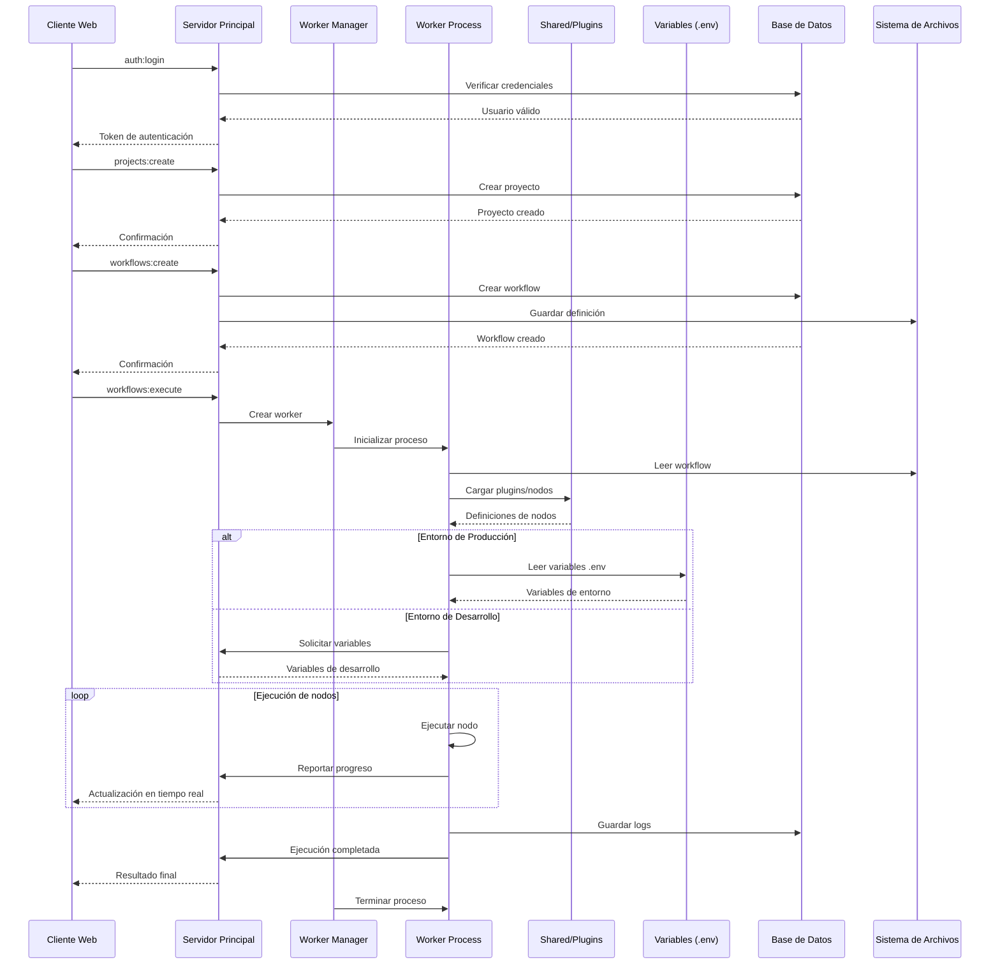
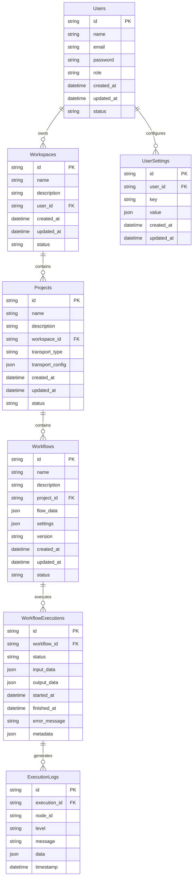
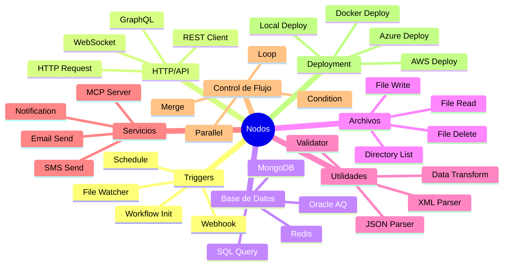
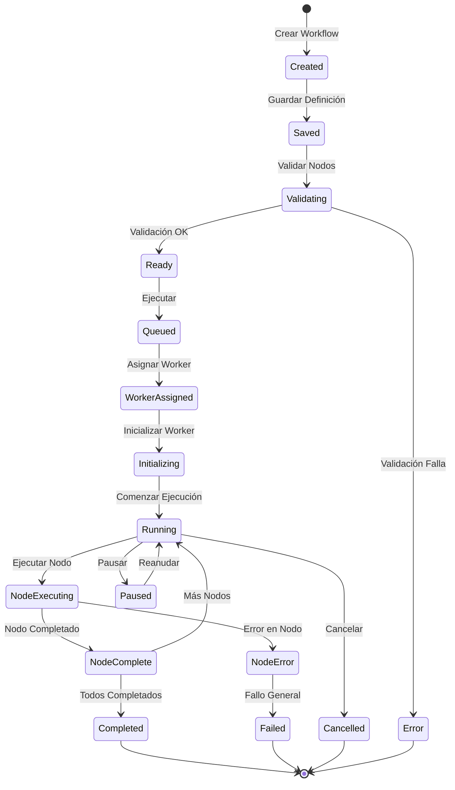

```mermaid
graph TB
    subgraph "Frontend (Vue.js)"
        UI[Cliente Web]
        Canvas[Canvas Editor]
        Dashboard[Dashboard]
        Auth[Autenticación]

        subgraph "Componentes Vue"
            ProjectView[Vista Proyectos]
            WorkflowView[Vista Workflows]
            NodeLib[Librería de Nodos]
            WorkersDash[Dashboard Workers]
        end

        subgraph "Stores (Pinia)"
            AuthStore[Auth Store]
            ProjectStore[Project Store]
            WorkflowStore[Workflow Store]
            SettingsStore[Settings Store]
        end
    end

    subgraph "Backend (Node.js + Express)"
        Server[Servidor Principal]
        SocketIO[Socket.IO]
        WorkerManager[Worker Manager]

        subgraph "Rutas Socket.IO"
            AuthRoutes[auth.ts]
            WorkspaceRoutes[workspaces.ts]
            ProjectRoutes[projects.ts]
            WorkflowRoutes[workflows.ts]
            NodeRoutes[nodes.ts]
            WorkerRoutes[workers.ts]
        end

        subgraph "Servicios"
            AuthService[Auth Service]
            WorkerService[Worker Service]
            NodeService[Node Service]
        end
    end

    subgraph "Workers (Procesos Independientes)"
        Worker1[Worker Process 1]
        Worker2[Worker Process 2]
        WorkerN[Worker Process N]

        subgraph "Módulos Worker"
            CoreModule[Core Module]
            CommModule[Communication Module]
            VarModule[Variables Module]
            WorkflowModule[Workflow Module]
        end
    end

    subgraph "Base de Datos"
        SQLite[(SQLite Database)]

        subgraph "Modelos"
            Users[Users]
            Workspaces[Workspaces]
            Projects[Projects]
            Workflows[Workflows]
            Executions[Workflow Executions]
            Logs[Execution Logs]
        end
    end

    subgraph "Sistema de Archivos"
        DataFolder[/data/]
        WorkflowFiles[workflow files]
        LogFiles[log files]
        ConfigFiles[config files]
    end

    subgraph "Shared (Código Compartido)"
        Interfaces[Interfaces TypeScript]
        Plugins[Plugins/Nodos]
        Stores[Stores Compartidos]
        Utils[Utilidades]

        subgraph "Plugins"
            NodePlugins[Node Plugins]
            DeployPlugins[Deploy Plugins]
        end
    end

    %% Conexiones principales
    UI --> SocketIO
    Canvas --> SocketIO
    Dashboard --> SocketIO

    SocketIO --> AuthRoutes
    SocketIO --> WorkspaceRoutes
    SocketIO --> ProjectRoutes
    SocketIO --> WorkflowRoutes
    SocketIO --> NodeRoutes
    SocketIO --> WorkerRoutes

    AuthRoutes --> AuthService
    WorkerRoutes --> WorkerService
    WorkerRoutes --> WorkerManager

    WorkerManager --> Worker1
    WorkerManager --> Worker2
    WorkerManager --> WorkerN

    Worker1 --> CoreModule
    Worker1 --> CommModule
    Worker1 --> VarModule
    Worker1 --> WorkflowModule

    Server --> SQLite
    AuthService --> Users
    WorkspaceRoutes --> Workspaces
    ProjectRoutes --> Projects
    WorkflowRoutes --> Workflows
    WorkflowRoutes --> Executions
    WorkflowRoutes --> Logs

    Workers --> DataFolder
    Workers --> WorkflowFiles
    Workers --> LogFiles

    Server --> Interfaces
    Workers --> Interfaces
    UI --> Interfaces

    Workers --> NodePlugins
    Workers --> DeployPlugins

    %% Estilos
    classDef frontend fill:#e1f5fe
    classDef backend fill:#f3e5f5
    classDef worker fill:#e8f5e8
    classDef database fill:#fff3e0
    classDef shared fill:#fce4ec
    classDef filesystem fill:#f1f8e9

    class UI,Canvas,Dashboard,Auth,ProjectView,WorkflowView,NodeLib,WorkersDash,AuthStore,ProjectStore,WorkflowStore,SettingsStore frontend
    class Server,SocketIO,WorkerManager,AuthRoutes,WorkspaceRoutes,ProjectRoutes,WorkflowRoutes,NodeRoutes,WorkerRoutes,AuthService,WorkerService,NodeService backend
    class Worker1,Worker2,WorkerN,CoreModule,CommModule,VarModule,WorkflowModule worker
    class SQLite,Users,Workspaces,Projects,Workflows,Executions,Logs database
    class Interfaces,Plugins,Stores,Utils,NodePlugins,DeployPlugins shared
    class DataFolder,WorkflowFiles,LogFiles,ConfigFiles filesystem
```

## Flujo de Datos y Comunicación

```mermaid
sequenceDiagram
    participant Client as Cliente Web
    participant Server as Servidor Principal
    participant WM as Worker Manager
    participant Worker as Worker Process
    participant Shared as Shared/Plugins
    participant Env as Variables (.env)
    participant DB as Base de Datos
    participant FS as Sistema de Archivos

    %% Autenticación
    Client->>Server: auth:login
    Server->>DB: Verificar credenciales
    DB-->>Server: Usuario válido
    Server-->>Client: Token de autenticación

    %% Crear proyecto
    Client->>Server: projects:create
    Server->>DB: Crear proyecto
    DB-->>Server: Proyecto creado
    Server-->>Client: Confirmación

    %% Crear workflow
    Client->>Server: workflows:create
    Server->>DB: Crear workflow
    Server->>FS: Guardar definición
    DB-->>Server: Workflow creado
    Server-->>Client: Confirmación

    %% Ejecutar workflow
    Client->>Server: workflows:execute
    Server->>WM: Crear worker
    WM->>Worker: Inicializar proceso
    Worker->>FS: Leer workflow

    %% Obtener información de nodos desde shared
    Worker->>Shared: Cargar plugins/nodos
    Shared-->>Worker: Definiciones de nodos

    %% Obtener variables según entorno
    alt Entorno de Producción
        Worker->>Env: Leer variables .env
        Env-->>Worker: Variables de entorno
    else Entorno de Desarrollo
        Worker->>Server: Solicitar variables
        Server-->>Worker: Variables de desarrollo
    end

    loop Ejecución de nodos
        Worker->>Worker: Ejecutar nodo
        Worker->>Server: Reportar progreso
        Server-->>Client: Actualización en tiempo real
    end

    Worker->>DB: Guardar logs
    Worker->>Server: Ejecución completada
    Server-->>Client: Resultado final
    WM->>Worker: Terminar proceso
```

## Estructura de Directorios

```mermaid
graph TD
    Root[Horizon v1/] --> Client[client/]
    Root --> Server[server/]
    Root --> Worker[worker/]
    Root --> Shared[shared/]
    Root --> Data[data/]
    Root --> Docs[docs/]
    Root --> Canvas[canvas/]
    Root --> Logs[logs/]

    Client --> ClientSrc[src/]
    Client --> ClientCanvas[canvas/]
    Client --> ClientPublic[public/]

    ClientSrc --> Components[components/]
    ClientSrc --> Views[views/]
    ClientSrc --> Stores[stores/]
    ClientSrc --> Router[router/]
    ClientSrc --> Services[services/]
    ClientSrc --> Utils[utils/]
    ClientSrc --> Layouts[layouts/]

    Server --> ServerSrc[src/]
    ServerSrc --> Models[models/]
    ServerSrc --> Routes[routes/]
    ServerSrc --> Services[services/]
    ServerSrc --> Middleware[middleware/]
    ServerSrc --> Config[config/]
    ServerSrc --> Seeders[seeders/]
    ServerSrc --> Migrations[migrations/]

    Worker --> WorkerModules[modules/]
    WorkerModules --> Core[core/]
    WorkerModules --> Communication[communication/]
    WorkerModules --> Variables[variables/]
    WorkerModules --> WorkflowMod[workflow/]

    Shared --> SharedInterfaces[interfaces/]
    Shared --> SharedPlugins[plugins/]
    Shared --> SharedStore[store/]
    Shared --> SharedUtils[utils/]
    Shared --> SharedClass[class/]

    SharedPlugins --> Nodes[nodes/]
    SharedPlugins --> Deploys[deploys/]

    Data --> WorkflowData[workflows/]
    Data --> ExecutionData[executions/]

    %% Estilos
    classDef folder fill:#e3f2fd
    classDef important fill:#ffecb3

    class Root,Client,Server,Worker,Shared important
    class ClientSrc,ServerSrc,WorkerModules,SharedPlugins important
```

## Arquitectura de Workers

```mermaid
graph TB
    subgraph "Servidor Principal"
        WM[Worker Manager]
        Routes[Worker Routes]
        Dashboard[Dashboard API]
    end

    subgraph "Worker Process 1"
        W1[Worker Instance]
        W1Core[Core Module]
        W1Comm[Communication]
        W1Workflow[Workflow Engine]
        W1Vars[Variables Manager]
    end

    subgraph "Worker Process 2"
        W2[Worker Instance]
        W2Core[Core Module]
        W2Comm[Communication]
        W2Workflow[Workflow Engine]
        W2Vars[Variables Manager]
    end

    subgraph "Worker Process N"
        WN[Worker Instance]
        WNCore[Core Module]
        WNComm[Communication]
        WNWorkflow[Workflow Engine]
        WNVars[Variables Manager]
    end

    subgraph "Comunicación"
        IPC[Inter-Process Communication]
        Messages[Message Queue]
        Stats[Statistics Collector]
    end

    subgraph "Node Plugins"
        HttpNode[HTTP Request]
        DbNode[Database]
        FileNode[File Operations]
        ValidatorNode[Validator]
        McpNode[MCP Server]
        OracleNode[Oracle AQ]
        TriggerNode[Triggers]
    end

    WM --> W1
    WM --> W2
    WM --> WN

    W1 --> W1Core
    W1 --> W1Comm
    W1 --> W1Workflow
    W1 --> W1Vars

    W2 --> W2Core
    W2 --> W2Comm
    W2 --> W2Workflow
    W2 --> W2Vars

    WN --> WNCore
    WN --> WNComm
    WN --> WNWorkflow
    WN --> WNVars

    W1Comm --> IPC
    W2Comm --> IPC
    WNComm --> IPC

    IPC --> Messages
    IPC --> Stats

    Messages --> Routes
    Stats --> Dashboard

    W1Workflow --> HttpNode
    W1Workflow --> DbNode
    W1Workflow --> FileNode
    W1Workflow --> ValidatorNode
    W1Workflow --> McpNode
    W1Workflow --> OracleNode
    W1Workflow --> TriggerNode

    %% Estilos
    classDef manager fill:#ffcdd2
    classDef worker fill:#c8e6c9
    classDef communication fill:#d1c4e9
    classDef plugin fill:#fff3e0

    class WM,Routes,Dashboard manager
    class W1,W2,WN,W1Core,W2Core,WNCore,W1Comm,W2Comm,WNComm worker
    class IPC,Messages,Stats communication
    class HttpNode,DbNode,FileNode,ValidatorNode,McpNode,OracleNode,TriggerNode plugin
```

## Modelo de Datos

```mermaid
erDiagram
    Users {
        string id PK
        string name
        string email
        string password
        string role
        datetime created_at
        datetime updated_at
        string status
    }

    Workspaces {
        string id PK
        string name
        string description
        string user_id FK
        datetime created_at
        datetime updated_at
        string status
    }

    Projects {
        string id PK
        string name
        string description
        string workspace_id FK
        string transport_type
        json transport_config
        datetime created_at
        datetime updated_at
        string status
    }

    Workflows {
        string id PK
        string name
        string description
        string project_id FK
        json flow_data
        json settings
        string version
        datetime created_at
        datetime updated_at
        string status
    }

    WorkflowExecutions {
        string id PK
        string workflow_id FK
        string status
        json input_data
        json output_data
        datetime started_at
        datetime finished_at
        string error_message
        json metadata
    }

    ExecutionLogs {
        string id PK
        string execution_id FK
        string node_id
        string level
        string message
        json data
        datetime timestamp
    }

    UserSettings {
        string id PK
        string user_id FK
        string key
        json value
        datetime created_at
        datetime updated_at
    }

    Users ||--o{ Workspaces : "owns"
    Workspaces ||--o{ Projects : "contains"
    Projects ||--o{ Workflows : "contains"
    Workflows ||--o{ WorkflowExecutions : "executes"
    WorkflowExecutions ||--o{ ExecutionLogs : "generates"
    Users ||--o{ UserSettings : "configures"
```

## Tipos de Nodos Disponibles

```mermaid
mindmap
  root((Nodos))
    Triggers
      Workflow Init
      Schedule
      Webhook
      File Watcher
    HTTP/API
      HTTP Request
      REST Client
      GraphQL
      WebSocket
    Base de Datos
      SQL Query
      MongoDB
      Redis
      Oracle AQ
    Archivos
      File Read
      File Write
      File Delete
      Directory List
    Utilidades
      Validator
      JSON Parser
      XML Parser
      Data Transform
    Servicios
      MCP Server
      Email Send
      SMS Send
      Notification
    Control de Flujo
      Condition
      Loop
      Parallel
      Merge
    Deployment
      Local Deploy
      Azure Deploy
      AWS Deploy
      Docker Deploy
```

## Flujo de Ejecución de Workflows

```mermaid
stateDiagram-v2
    [*] --> Created: Crear Workflow
    Created --> Saved: Guardar Definición
    Saved --> Validating: Validar Nodos
    Validating --> Ready: Validación OK
    Validating --> Error: Validación Falla
    Ready --> Queued: Ejecutar
    Queued --> WorkerAssigned: Asignar Worker
    WorkerAssigned --> Initializing: Inicializar Worker
    Initializing --> Running: Comenzar Ejecución
    Running --> NodeExecuting: Ejecutar Nodo
    NodeExecuting --> NodeComplete: Nodo Completado
    NodeComplete --> Running: Más Nodos
    NodeComplete --> Completed: Todos Completados
    NodeExecuting --> NodeError: Error en Nodo
    NodeError --> Failed: Fallo General
    Running --> Paused: Pausar
    Paused --> Running: Reanudar
    Running --> Cancelled: Cancelar
    Completed --> [*]
    Failed --> [*]
    Cancelled --> [*]
    Error --> [*]
```
